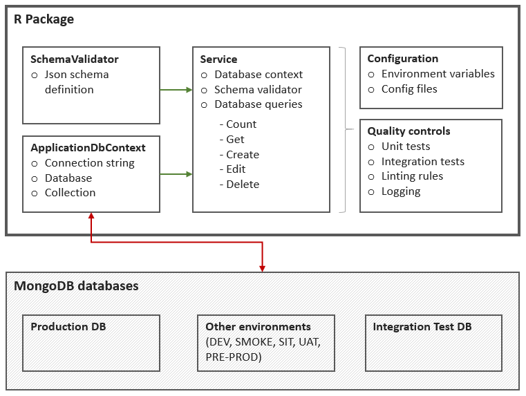

# rBuildReleaseTest
Proof of Concept R Package to explore MongoDb, DevOps and best practice.

<!-- badges: start -->
[](https://travis-ci.org/nik01010/rBuildReleaseTest)
[](https://github.com/nik01010/rBuildReleaseTest/actions)
[](https://codecov.io/gh/nik01010/rBuildReleaseTest?branch=develop)
[](https://github.com/emersion/stability-badges#experimental)
<!-- badges: end -->

## Aims
This PoC package is used to explore:

#### Database queries
- Creating robust queries for reading and writing data stored in a MongoDb database
- Using object-oriented programming to encapsulate queries in an R6 class

#### Best practice
- Automating code format checks using a custom linter
- Setting up a logger with custom message formatting, applied throughout all layers of code
- Using environment variables for greater flexibility and securing connection strings

#### Automated testing
- Writing unit tests for basic functions and integration-style tests for database queries
- Producing test coverage reports with a minimum required threshold
- Creating a Continuous Integration (CI) pipeline that builds, checks and tests the R package, runs linting rules, and test coverage analysis
- Setting up CI pipelines on multiple platforms - Jenkins, TravisCI and GitHub actions, across multiple operating systems and R versions


## Prerequisites
Using this package requires the following:
- Mongo Atlas instance, for running database queries (against the companies collection, sample_training database)
- Localhost MongoDb instance, for running database integration tests
- TravisCI account, and/or Jenkins instance, for running continuous integration tests
- Some environment variables need setting up (see Annex at end)


## R package design


### Main components
There are several main components contained in the /R/ folder:
- ApplicationDbContext: this class is used to initiate a database connection to MongoDb, against a provided connection string and database/collection name
- CompaniesSchemaValidator: creates a schema definition for the Companies collection; any incoming data can be validated against the schema
- InitialiseLogger: creates and configures an application Logger, using a custom message format with improved detail
- CompaniesService: this class acts as a data service, by providing a set of robust queries against the Companies database, such as counting, reading and writing data. The database connection created above using the ApplicationDbContext class is injected into this CompaniesService. This allows all queries to be tested more easily, as we can inject a dummy database connection when running the integration tests

### Tests
There are several types of tests included in the /tests/ folder:
- Integration-style unit tests, for testing the database connection and queries, the logger etc
- Classical unit tests for checking the more standard functions 
- Typically tests follow the C# naming and structure conventions
- A linter check is included in the .lintr configuration file, based on camel and pascal case styling

### Continuous integration
- <a href="https://travis-ci.org/github/nik01010/rBuildReleaseTest" target="_blank">TravisCI builds</a> are defined in the .travis.yml configuration file. These run for every pull request, and run on Mac OS and Linux, for R-rel, R-dev and R-oldrel.
- <a href="https://github.com/nik01010/rBuildReleaseTest/actions" target="_blank">GitHub Actions builds</a> are defined in the /.github/ folder, and run on Windows Server, for R-rel and R-dev.
- Both TravisCI and GitHub Actions start up a fresh MongoDb localhost instance for every build, in order for the integration tests to run. Both also install the latest versions of any package dependencies for each build, but support caching packages to speed up run times when no new updates are available since the previous build.
- Jenkins builds are defined in the Jenkinsfile and Makefile configs. Currently, the Jenkins builds are not containerised, but use the box's normal R library, and rely on a localhost MongoDb instance being installed.


## How to use
```R
# Install package
devtools::install_github(repo = "nik01010/rBuildReleaseTest", ref = "develop")

# Load package
library(rBuildReleaseTest)

# Set up logger
rBuildReleaseTest::InitialiseLogger()

# Get MongoDB connection string from environment variables
# See section in this ReadMe below for how to configure this
mongoConnectionString <- Sys.getenv("MONGO_CS_DEV")

# Initialise a new database context
companiesContext <- rBuildReleaseTest::ApplicationDbContext$new(
  connectionString = mongoConnectionString,
  database = "sample_training",
  collection = "companies"
)

# Initialise a new JSON schema validator for the companies collection
companiesSchemaValidator <- rBuildReleaseTest::CompaniesSchemaValidator()

# Initialise a new database query service
companiesService <- rBuildReleaseTest::CompaniesService$new(
  dbContext = companiesContext,
  schemaValidator = companiesSchemaValidator
)

# Example queries
count <- companiesService$getCompaniesCount()

allCompanies <- companiesService$getCompanies()

companyFacebook <- companiesService$getCompany(companyName = "Facebook")
companyNokia <- companiesService$getCompany(companyName = "Nokia")

companyNokiaId <- companiesService$getCompanyId(companyName = "Nokia")

numberOfCompaniesPerYear <- companiesService$getNumberOfCompaniesFoundedPerYear()

oldestCompanies <- companiesService$getOldestCompanies(limit = 25)

newCompany <- '{
  "name": "TestCompany1",
  "founded_year": 2019
}'
companiesService$createCompany(companyDetails = newCompany)

newCompanyEdited <- '{
  "name": "TestCompany1",
  "founded_year": 2020
}'
companiesService$editCompany(companyName = "TestCompany1", newCompanyDetails = newCompanyEdited)

companiesService$deleteCompany(companyName = "TestCompany1")

# Cleanup
rm(companiesContext)
rm(companiesService)

```

## Annex: Set up environment variables
This package depends on specific environment variables being present. Below are basic instructions for setting up the variables.
#### On local Windows machine:
- Ensure there is a .Renviron file in the User's Home directory (e.g. C:\Users\YourUsername\Documents).
- Add the below connection string variables in the .Renviron file. These will allow the package to connect to different MongoDb databases that have been configured, under different scenarios such as running production code or running tests. The Local and Unit Test connections are pointing to a localhost instance of MongoDb, which must already be installed on the machine running the code.
```R
MONGO_CS_LOCAL = "mongodb://127.0.0.1:27017/"
MONGO_CS_UNIT = "mongodb://127.0.0.1:27017/"
MONGO_CS_DEV = "mongodb+srv://YourMongoAtlasConnectionString"
```

#### On TravisCI:
- Go to the required repo's Settings page, and find the Environment Variables section.
- Add the below environment variable (encrypted if required), which will enable unit tests to be run against a dummy database as part of a build.

| Variable      | Value                      |
| ------------- |----------------------------|
| MONGO_CS_UNIT | mongodb://127.0.0.1:27017/ |

- The .travis.yml file in this repository enables the MongoDb service for each build, and will run on the standard localhost address used above.

#### On Jenkins:
- Go to the required Node's Configure settings page, and create the below environment variables. The R_LIBS variable is used by the R CMD CHECK process, although this may vary for users with different configurations or operating systems.

| Variable      | Value                      |
| ------------- |----------------------------|
| MONGO_CS_UNIT | mongodb://127.0.0.1:27017/ |
| R_LIBS        | C:/Users/YourUserName/Documents/R/win-library/YourRVersionNumber |
